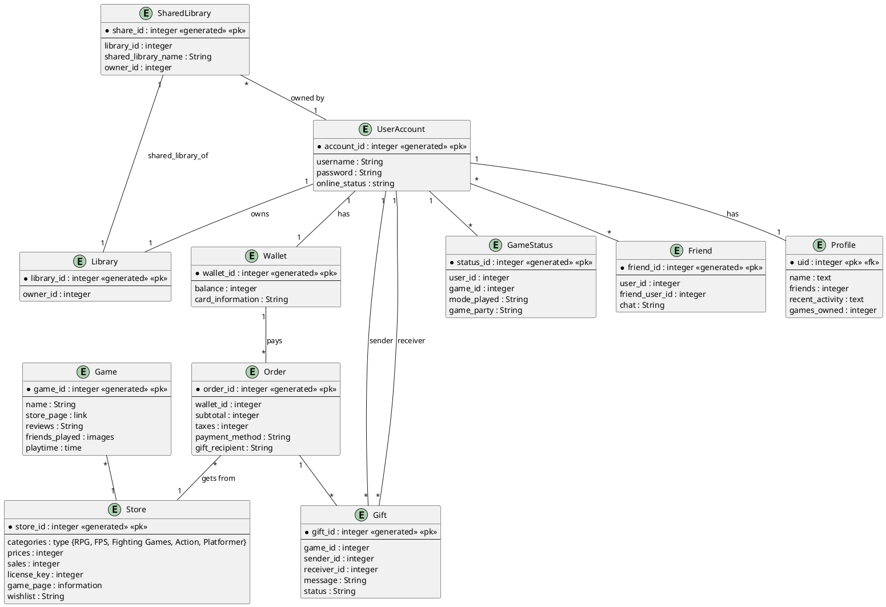
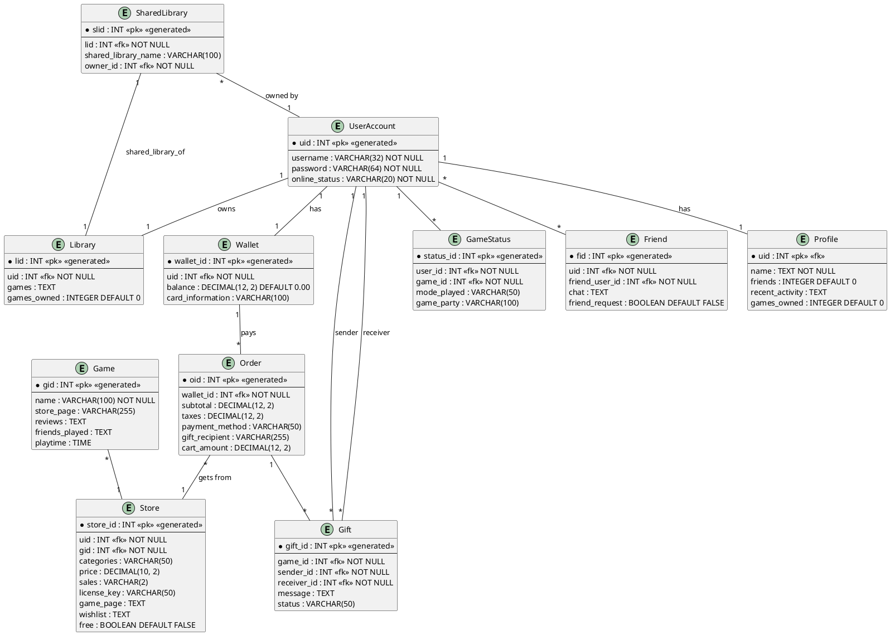

## Steam Project

github link : https://github.com/edwinkras/steam_db_project.git

# Project made by: Edwin

## 1. General Description

In this project, I decided to go with Steam due to my knowledge of it as I've been a user of it for years. The goal here with the database is to represent how the system works (and how different features are connected with each other, hence the relationships). The main functionalities that I’ve needed to take care of are the very fundamentals of Steam, also the main entities I’ve added: 
 
- User Account Management – Each user has an account with login details, a profile, and a wallet for purchases.

- Game Library System: Each user owns a personal game library, containing the games they have purchased or received. 

- Storefront: The store contains game listings, pricing, reviews, and category-based browsing. 

- Game Status Tracking: Users can see the current game and play mode their friends are using, including the party they are playing with. 

- Friends System: Users can add friends and communicate with them. 

- Gifting System: Users can send and receive games as gifts. 

- Shared Library (Family Sharing): Users can share their libraries with friends/family and access another user’s shared library (Steam Family Sharing). 

- Order and Payment Management: Tracks user purchases, including subtotal, taxes, and payment methods.

## 2. a) Logical Model

## b) Physical Model

- For the main entities and relationships, I have structured the database around 9 core entities that support each other and reflect the essential Steam features:

- UserAccount – Represents a Steam user with login credentials and profile-related information.

- Library – Each user owns one personal game library. This entity stores game references (as text) directly within the library.

- Game – Represents individual games available on the platform.

- Store – Contains information about games available for purchase, including pricing, sales, categories, and developer details.

- Wallet – Each user has a wallet managing their balance and payment methods.

- Gift – Represents games sent as gifts from one user to another.

- GameStatus – Tracks which game a user is currently playing, including play mode and party details.

- Friend – Models friendships between users, including friend requests and chat history.

- Order – Records user purchases, linking wallets, purchased games, prices, and gift information.

- SharedLibrary – Represents a shared game library where a user can share their library with friends or family. 
- It directly links to a user account, a library, and a friend, without using a separate membership table.

 

For the relationships between the entities: 
 

- A UserAccount owns exactly one Library and one Wallet.

- Each Library contains a list of games owned by the user (stored as text), instead of being linked via a separate relationship table.

- A UserAccount can have many Friends, representing friend connections and enabling chat.

- The GameStatus tracks which game and mode a user is currently playing, linking to both user and game.

- A Game appears in the Store, where users can view pricing, sales, and category details.

- Orders are placed by users through their Wallets, recording purchase details.

- Gifts are sent and received between users, linking sender and receiver accounts with the gifted game.

- The SharedLibrary allows a user to share their Library with a friend, linking directly the library, owner user, 
- and the friend user in one entity without an additional linking table.