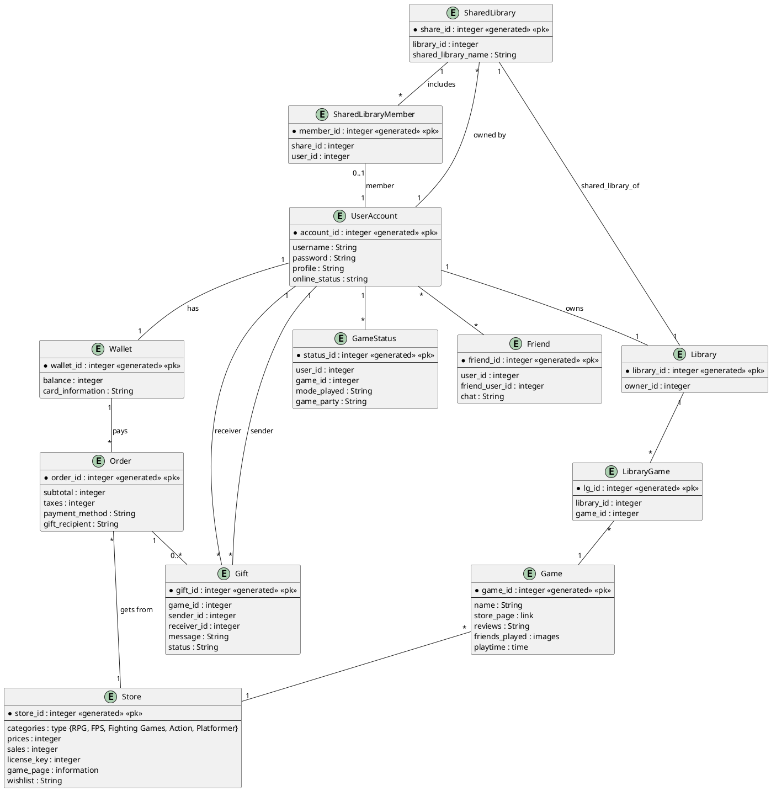
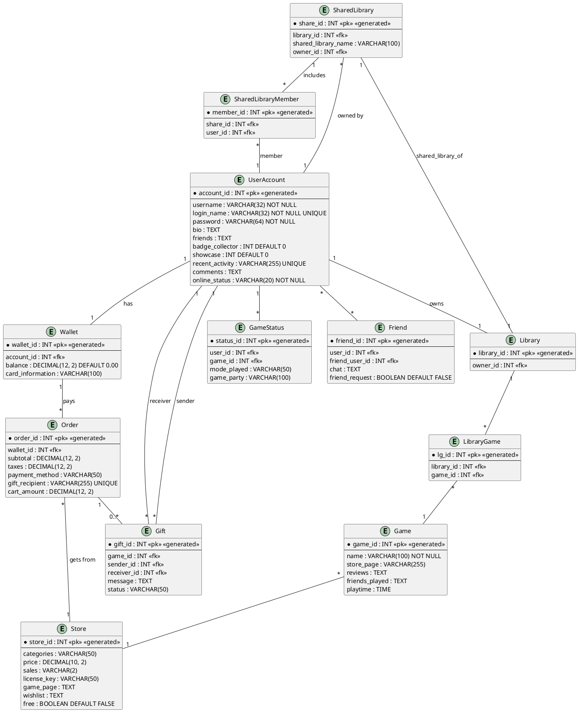

## Steam Project

# Project made by: Edwin

# General Description

In this project, I decided to go with Steam due to my knowledge of it as I've been a user of it for years. The goal here with the database is to represent how the system works (and how different features are connected with each other, hence the relationships). The main functionalities that I’ve needed to take care of are the very fundamentals of Steam, also the main entities I’ve added: 
 
- User Account Management – Each user has an account with login details, profile info, and a wallet for purchases. 

- Game Library System: Each user owns a personal game library, containing the games they have purchased or received. 

- Storefront: The store contains game listings, pricing, reviews, and category-based browsing. 

- Game Status Tracking: Users can see the current game and play mode their friends are using, including the party they are playing with. 

- Friends System: Users can add friends and communicate with them. 

- Gifting System: Users can send and receive games as gifts. 

- Shared Library (Family Sharing): Users can share their libraries with friends/family and access another user’s shared library (Steam Family Sharing). 

- Order and Payment Management: Tracks user purchases, including subtotal, taxes, and payment methods.

# Logical Model

# Physical Model

For the main entities and relationships, I’ve made 11 (9 if we're not counting relationship tables) that connect each other in different ways but support each other in the long run:  

1. UserAccount – Represents a Steam user. 

2. Library – Each user owns one library that holds their games. 

3. Game – Represents individual games on the platform. 

4. Store – Contains information like pricing, sales, and game categories. 

5. Wallet – Each user has a wallet to manage their balance and payment methods. 

6. Gift – Represents games sent from one user to another. 

7. GameStatus – Tracks what game and mode a user is currently playing. 

8. Friend – Represents the friend connections between users. 

9. Order – Represents game purchases by the user. 

10. SharedLibrary – Represents a shared game library a user can create. 

11. SharedLibraryMember – Links users to shared libraries they are part of. 

For the relationship tables, I introduced two of them that support the system: 

- LibraryGame – Connects Library and Game, allowing users to own multiple games and each game to exist in multiple libraries. 

- SharedLibraryMember – Connects SharedLibrary and UserAccount, modeling the Steam Family Sharing system. 

 

For the relationships between the entities: 
 

- A UserAccount is linked to one Library, one Wallet, many Friends, and can send and receive many Gifts. 

- A Library connects to multiple Games through LibraryGame. 

- A Game appears in the Store, and is linked to one or more Categories. 

- A UserAccount can be a member of only one SharedLibrary at a time, matching Steam’s restriction. 

- An Order is paid for using a Wallet and gets products (games) from the Store. 

- The GameStatus tracks what game a user is currently playing and with whom. 